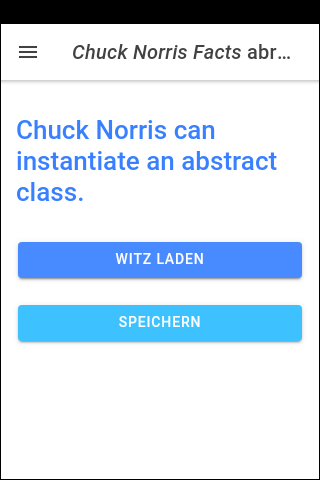

# Ionic app to fetch Chuck Norris facts from icndb.com #

Simple Ionic app to fetch so called *Chuck Norris facts* (short jokes) from
ICNDB.com's web API.

 

----

## Screenshots ##

 

----

## References ##

* [Description of REST-API provided by ICNDB](http://www.icndb.com/api/)

* [Article on "Chuck Norris facts" on Wikipedia](https://en.wikipedia.org/wiki/Chuck_Norris_facts)

* [Video "Chuck Norris facts read by Chuck Norris" on youtube.com](https://www.youtube.com/watch?v=kQmPMZeN7JQ)

* Similar API: https://api.chucknorris.io/

 

----

## License ##

See the [LICENSE file](LICENSE.md) for license rights and limitations (GPL v3) for the files in this repository.

The author of this application is *NEITHER* related to [The Internet Chuck Norris Database (icndb.com)](http://www.icndb.com/) *NOR* to Chuck Norris.